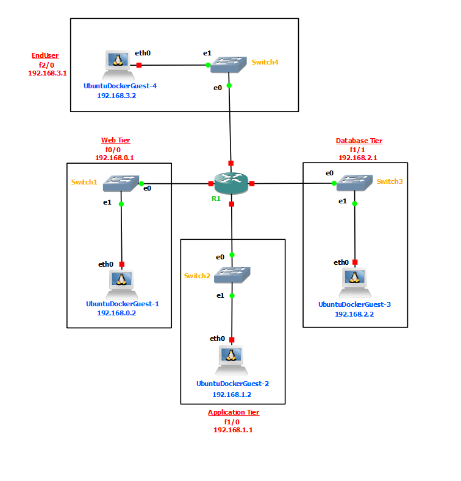
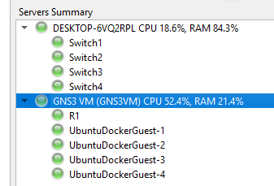

# Cloud Computing Security Project: Configuring and Testing NACLs in GNS3

## Project Overview
This project was completed as part of the Cloud Computing Security course (IT2010043452) at Hashemite University, Spring 2024/2025. I implemented and tested Network Access Control Lists (NACLs) in a Virtual Private Cloud (VPC) environment using GNS3 to secure a three-tier network architecture.

## Network Architecture
I configured a three-tier network with the following subnets:
- **Web Tier**: 192.168.0.0/24
- **Application Tier**: 192.168.1.0/24
- **Database Tier**: 192.168.2.0/24

## Implemented Security Rules
### Web Tier (192.168.0.0/24)
- ✅ Allows incoming HTTP (port 80) and HTTPS (port 443) traffic
- ❌ Blocks all other incoming traffic

### Application Tier (192.168.1.0/24)
- ✅ Accepts traffic from Web Tier on port 8080
- ✅ Accepts traffic from Database Tier on port 3306 (MySQL)
- ❌ Blocks all other traffic

### Database Tier (192.168.2.0/24)
- ✅ Only allows access from Application Tier on port 3306
- ❌ Blocks all outbound traffic

## Project Implementation
1. **GNS3 Setup**
   - Installed GNS3 and configured the network topology
   - Created routers and switches for all three tiers
   - Assigned appropriate IP addresses to interfaces

2. **ACL Configuration**
   - Designed ACL rules for each tier based on requirements
   - Applied ACLs to appropriate interfaces (inbound/outbound)
   - Configured routing between tiers

3. **Testing**
   - Verified HTTP/HTTPS access to Web Tier
   - Tested Application Tier connectivity on ports 8080 and 3306
   - Validated Database Tier restrictions
   - Confirmed all deny rules are working properly
   - used curl command for pinging

## Course Information
- **Course**: Cloud Computing Security (IT2010043452)
- **Instructor**: Dr. Musab Alghadi
- **Semester**: Spring 2024/2025
- **Faculty**: IT Department, Faculty of Prince Al-Hussein Bin Abdallah II for Information Technology
- **University**: Hashemite University, Zarqa, Jordan

This project helps understanding practical implementation of ACLs in cloud environments and their role in securing different network tiers.